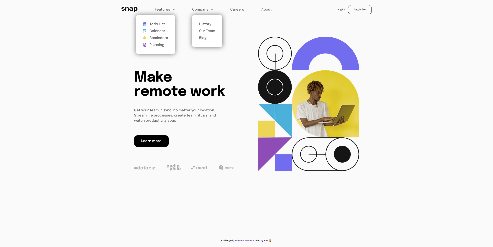

# Frontend Mentor - Intro section with dropdown navigation solution

This is a solution to the [Intro section with dropdown navigation challenge on Frontend Mentor](https://www.frontendmentor.io/challenges/intro-section-with-dropdown-navigation-ryaPetHE5). Frontend Mentor challenges help you improve your coding skills by building realistic projects.

## Table of contents

- [Overview](#overview)
  - [The challenge](#the-challenge)
  - [Screenshot](#screenshot)
  - [Links](#links)
- [My process](#my-process)
  - [Built with](#built-with)
  - [What I learned](#what-i-learned)
  - [Continued development](#continued-development)
  - [Useful resources](#useful-resources)
- [Author](#author)

## Overview

### The challenge

Users should be able to:

- View the relevant dropdown menus on desktop and mobile when interacting with the navigation links
- View the optimal layout for the content depending on their device's screen size
- See hover states for all interactive elements on the page

### Screenshot

### Links

- Solution URL: [Repo](https://github.com/CallMe-AL/fementor-drop-nav)
- Live Site URL: [Live site](https://callme-al.github.io/fementor-drop-nav/)

## My process

### Built with

- Semantic HTML5 markup
- CSS custom properties
- Flexbox
- CSS Grid
- Mobile-first workflow

### What I learned

I tried using more modern CSS functions in this approach, particularly min() and clamp(). I also tried using Grid much more in the main design. I first learned about those functions by following Kevin Powell's course on this site. Those functions, coupled with grid-template-areas, certainly make responsive design much easier!! Using variables for font sizes also helped make the responsive design easier.

### Continued development

I definitely want to keep working with the functions and use Grid much more often. I'm still slightly confused how min() works especially (such as how the browser determines which value to use). I also got tripped up with working with the svg image inside of the main grid layout. I'd like to investigate more how to more easily work with images inside a grid layout.

### Useful resources

- [Web Dev's min, max, and clamp discussion](https://web.dev/min-max-clamp/) - Useful introduction to the functions.
- [CSS Dropdown Menus](https://css-tricks.com/solved-with-css-dropdown-menus/) - Though I opted not to use hover menus (I find them a bit intrusive), the discussion on making drop menus more accessible was very useful when thinking about my design.

## Author

- Website - [Portfolio](https://callme-al.github.io/portfolio/)
- Frontend Mentor - [@CallMe-AL](https://www.frontendmentor.io/profile/CallMe-AL)
